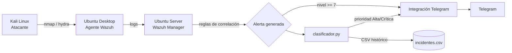
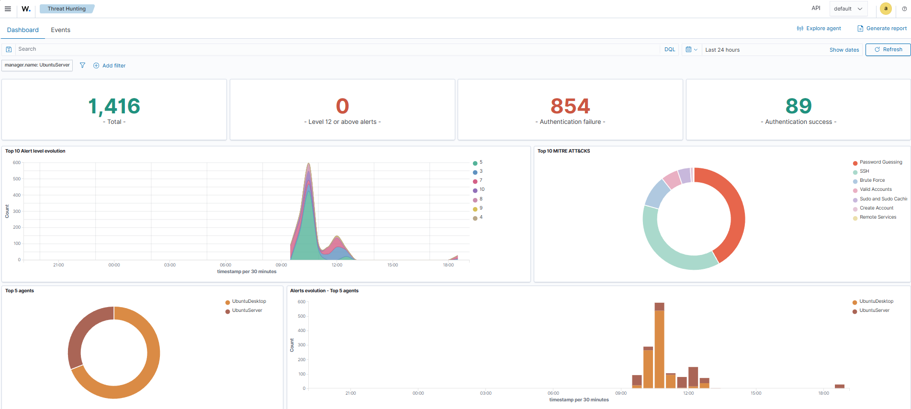
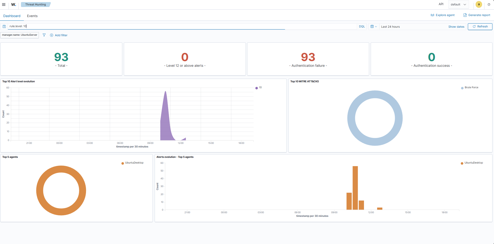
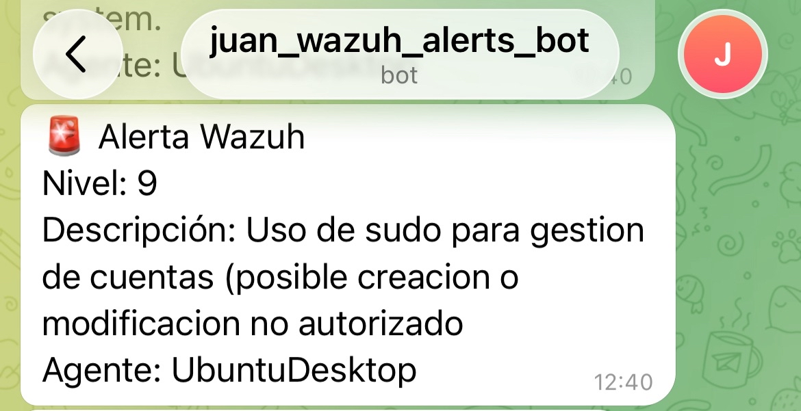
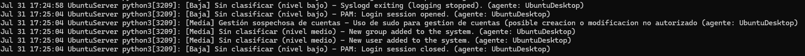

# home-soc
SOC doméstico con Wazuh, alertas Telegram y clasificación automática de incidentes con un script en Python.
## Arquitectura

## Componentes
- **Wazuh Manager** (Ubuntu Server): recibe logs, aplica reglas, genera alertas.
- **Agente Wazuh** (Ubuntu Desktop): monitoriza el sistema y envía eventos al Manager.
- **Kali Linux**: máquina atacante para generar tráfico malicioso de prueba.
- **Reglas de correlación personalizadas** (`reglas/local_rules.xml`):
  - `100010`: detección de fuerza bruta SSH (5 intentos fallidos en 2 min, MITRE T1110) — dispara además un bloqueo automático de IP (ver Proyecto 2).
  - `100011`: detección de gestión sospechosa de cuentas de usuario (MITRE T1136).
- **Integración con Telegram** (`integrations/custom-telegram.py`): alertas en tiempo real vía bot.
- **Clasificador de incidentes** (`clasificador/clasificador.py`): script en Python que lee las alertas de Wazuh en tiempo real, las clasifica por categoría y prioridad, guarda un histórico en CSV, y solo escala a Telegram las de prioridad Alta/Crítica. Corre como servicio de systemd.
## Instalación (resumen)
1. Desplegar 3 VMs en VirtualBox (Manager, Agente, Atacante) en red host-only.
2. Instalar Wazuh en el Manager con el instalador oficial.
3. Instalar el agente de Wazuh en el Ubuntu Desktop.
4. Copiar `reglas/local_rules.xml` a `/var/ossec/etc/rules/` en el Manager y reiniciar el servicio.
5. Configurar el bot de Telegram y copiar `integrations/custom-telegram.py` a `/var/ossec/integrations/`.
6. Desplegar `clasificador/clasificador.py` como servicio de systemd en el Manager.
7. Configurar Active Response en `ossec.conf` del Manager (ver `playbook-ir/playbook-ir-fuerza-bruta-ssh.md`, sección 1.2) y reiniciar `wazuh-manager`.
## Capturas
**Dashboard general de Wazuh**

## Proyecto 2 — Playbook de Respuesta a Incidentes
Extensión del SOC con **respuesta activa automática**: al detectarse un patrón de fuerza bruta SSH (regla `100010`), Wazuh bloquea automáticamente la IP atacante mediante Active Response, sin intervención manual. Documentación completa con estructura NIST SP 800-61 (Detección, Contención, Lecciones Aprendidas): [playbook-ir/playbook-ir-fuerza-bruta-ssh.md](./playbook-ir/playbook-ir-fuerza-bruta-ssh.md)
## Proyecto 3 — IDS de Red con Suricata
Segunda capa de detección (NIDS), complementaria a Wazuh: **Suricata** inspecciona el tráfico de red directamente, detectando escaneos de puertos y patrones que los logs de host nunca registran. Regla personalizada propia, integrada de forma nativa con Wazuh (EVE JSON). Documentación completa: [suricata-ids/suricata-ids-integracion.md](./suricata-ids/suricata-ids-integracion.md)
## Próximos pasos
- Firewall perimetral (pfSense/OPNsense) con Suricata como motor IDS/IPS integrado.
- Reglas adicionales para detección de tráfico C2 y exfiltración de datos.
