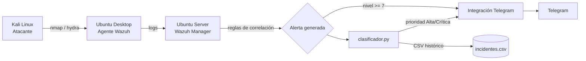
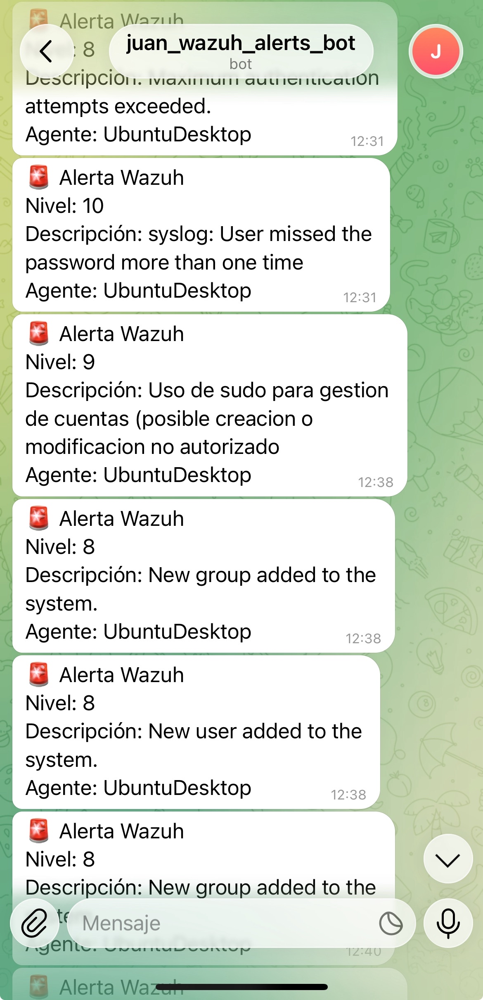

# home-soc

SOC doméstico con Wazuh, alertas Telegram y clasificación automática de incidentes con un script en Python.

## Arquitectura

## Componentes

- **Wazuh Manager** (Ubuntu Server): recibe logs, aplica reglas, genera alertas.
- **Agente Wazuh** (Ubuntu Desktop): monitoriza el sistema y envía eventos al Manager.
- **Kali Linux**: máquina atacante para generar tráfico malicioso de prueba.
- **Reglas de correlación personalizadas** (`reglas/local_rules.xml`):
  - `100010`: detección de fuerza bruta SSH (5 intentos fallidos en 2 min, MITRE T1110).
  - `100011`: detección de gestión sospechosa de cuentas de usuario (MITRE T1136).
- **Integración con Telegram** (`integrations/custom-telegram.py`): alertas en tiempo real vía bot.
- **Clasificador de incidentes** (`clasificador/clasificador.py`): script en Python que lee las alertas de Wazuh en tiempo real, las clasifica por categoría y prioridad, guarda un histórico en CSV, y solo escala a Telegram las de prioridad Alta/Crítica. Corre como servicio de systemd.

## Instalación (resumen)

1. Desplegar 3 VMs en VirtualBox (Manager, Agente, Atacante) en red host-only.
2. Instalar Wazuh en el Manager con el instalador oficial.
3. Instalar el agente de Wazuh en el Ubuntu Desktop.
4. Copiar `reglas/local_rules.xml` a `/var/ossec/etc/rules/` en el Manager y reiniciar el servicio.
5. Configurar el bot de Telegram y copiar `integrations/custom-telegram.py` a `/var/ossec/integrations/`.
6. Desplegar `clasificador/clasificador.py` como servicio de systemd en el Manager.

## Capturas

**Dashboard general de Wazuh**

**Alerta de fuerza bruta detectada (regla personalizada, MITRE ATT&CK)**

**Notificación en tiempo real vía Telegram**

**Clasificador de incidentes en funcionamiento**

## Próximos pasos

- Regla de correlación para detección de escaneo de puertos vía logs de firewall (ufw).
- Integración con más fuentes (Docker, cloud).
