# Proyecto 4 — Firewall Perimetral con pfSense e IDS/IPS Suricata

## Índice

1. [Introducción y objetivo](#introducción-y-objetivo)
2. [Arquitectura de red](#arquitectura-de-red)
3. [Instalación y configuración inicial de pfSense](#instalación-y-configuración-inicial-de-pfsense)
4. [Reglas de firewall (LAN deny-by-default)](#reglas-de-firewall-lan-deny-by-default)
5. [Suricata en pfSense: instalación y modo IDS](#suricata-en-pfsense-instalación-y-modo-ids)
6. [Modo IPS: de la detección al bloqueo activo](#modo-ips-de-la-detección-al-bloqueo-activo)
7. [Integración con Wazuh](#integración-con-wazuh)
8. [Comparativa: Suricata en host vs Suricata en firewall perimetral](#comparativa-suricata-en-host-vs-suricata-en-firewall-perimetral)
9. [Lecciones aprendidas](#lecciones-aprendidas)
10. [Conclusión](#conclusión)

---

## Introducción y objetivo

Este proyecto añade una capa de seguridad perimetral al laboratorio SOC doméstico mediante **pfSense CE**, actuando como firewall entre una red "externa" simulada (WAN) y la red interna del laboratorio (LAN). Sobre esa misma máquina se despliega **Suricata**, primero en modo de detección (IDS) y después en modo de prevención activa (IPS), integrando finalmente sus alertas con el SIEM Wazuh ya construido en proyectos anteriores.

El objetivo no es solo levantar el firewall, sino demostrar el ciclo completo: **segmentación de red → filtrado de tráfico → detección de amenazas → bloqueo activo → correlación centralizada en el SIEM**, replicando a pequeña escala la arquitectura de un perímetro de red corporativo.

---

## Arquitectura de red

| Elemento | Red | IP | Rol |
|---|---|---|---|
| Kali Linux | vboxnet0 | 192.168.56.106 | Atacante |
| pfSense WAN (em0) | vboxnet0 | 192.168.56.10/24 | Firewall perimetral |
| pfSense LAN (em1) | vboxnet1 | 192.168.57.1/24 | Firewall perimetral |
| Wazuh Manager | vboxnet0 | 192.168.56.105 | SIEM |
| Ubuntu Desktop | vboxnet1 | 192.168.57.104 | Agente Wazuh + Suricata (Proyecto 3) |

**Nota sobre la IP de la WAN:** inicialmente se configuró `192.168.56.1`, la misma que originalmente iba a usar pfSense como puerta de entrada simulada. Como se explica en detalle en la sección de Lecciones Aprendidas, esa IP entra en conflicto con el propio adaptador host-only de VirtualBox en el equipo anfitrión, por lo que finalmente se fijó en `192.168.56.10`.

---

## Instalación y configuración inicial de pfSense

Se instaló pfSense CE 2.8.1 sobre una VM nueva en VirtualBox, con dos interfaces de red: WAN sobre `vboxnet0` y LAN sobre `vboxnet1`.

**Bug del instalador (ver Lecciones Aprendidas):** el instalador de pfSense necesita descargar componentes desde servidores de Netgate durante la instalación. En una topología 100% aislada (host-only), el proceso se queda colgado indefinidamente en la pantalla de asignación de interfaces. La solución fue poner temporalmente el Adaptador 1 (WAN) en modo NAT durante la instalación, y revertirlo a host-only después.

Configuración del Setup Wizard:
- Hostname: `pfsense-fw`, dominio `home.arpa`
- Zona horaria: Europe/Madrid
- **"Block RFC1918 Private Networks" desmarcado** en la interfaz WAN — imprescindible porque toda la red del laboratorio usa direccionamiento privado (RFC1918); si se deja marcado, pfSense bloquea todo el tráfico de Kali por defecto.

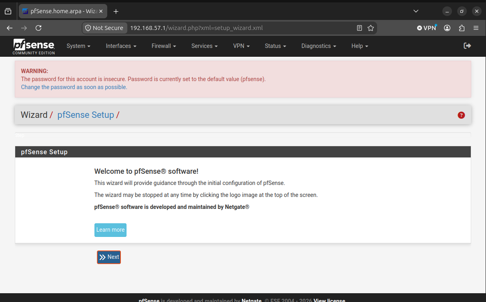
*Login/Wizard inicial, con aviso de contraseña insegura tras la instalación.*

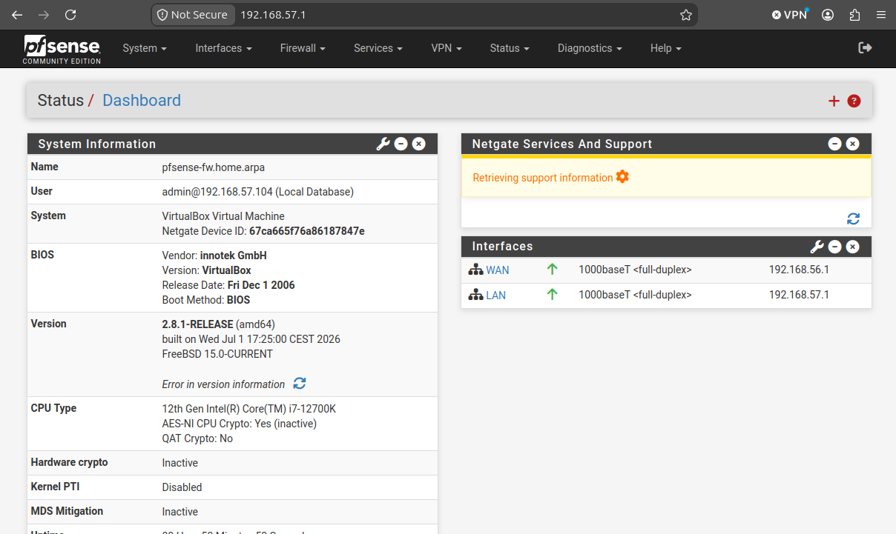
*Dashboard de pfSense tras completar el Setup Wizard.*

---

## Reglas de firewall (LAN deny-by-default)

Se desactivó la regla por defecto "Default allow LAN to any rule" y se crearon reglas explícitas de tipo *allowlist*:

| Servicio | Puerto | Origen | Destino |
|---|---|---|---|
| DNS | 53 | LAN subnets | Any |
| HTTP | 80 | LAN subnets | Any |
| HTTPS | 443 | LAN subnets | Any |
| ICMP echo request | — | LAN subnets | Any |

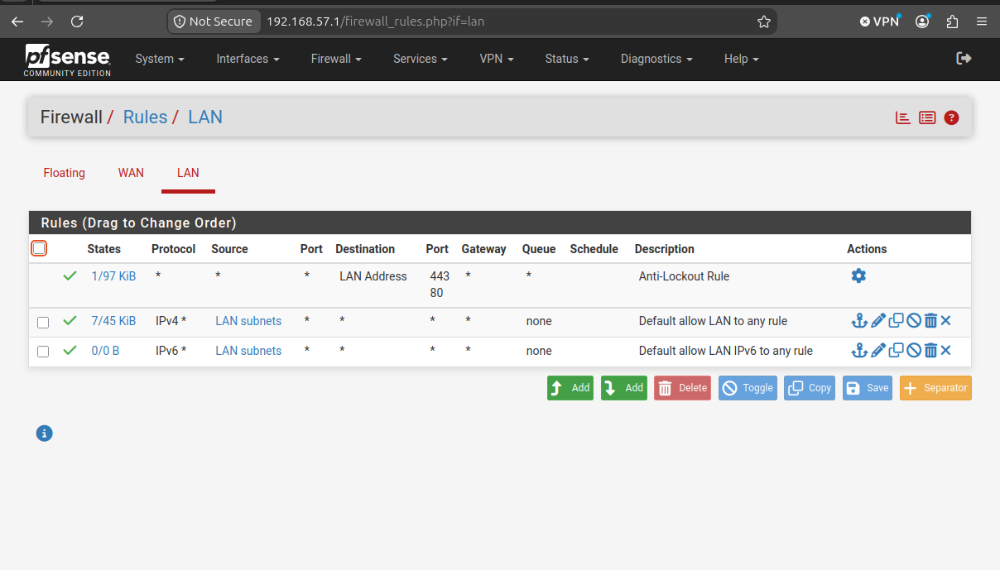
*Reglas LAN por defecto, antes de restringir el acceso.*

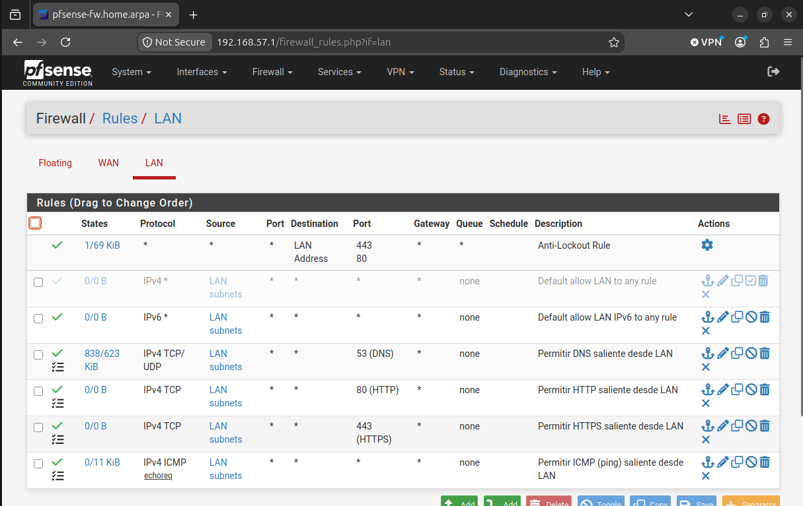
*Reglas LAN finales: 4 reglas explícitas + regla "allow any" desactivada.*

**Verificación:**
- Ping ICMP: Desktop → Wazuh Manager → **éxito**
- HTTPS: `curl -Ik https://192.168.56.105` → **respuesta 302** (Wazuh Dashboard, regla permitida)
- SSH (puerto no autorizado): `nc -zv -w 3 192.168.56.105 22` → **timeout** (bloqueado correctamente por la regla deny-by-default)

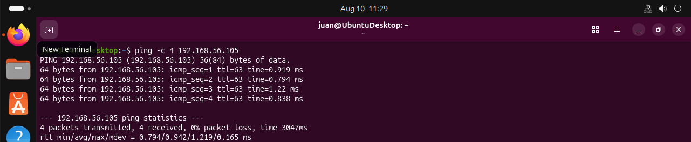
*Ping ICMP exitoso Desktop → Wazuh Manager (regla permitida funcionando).*

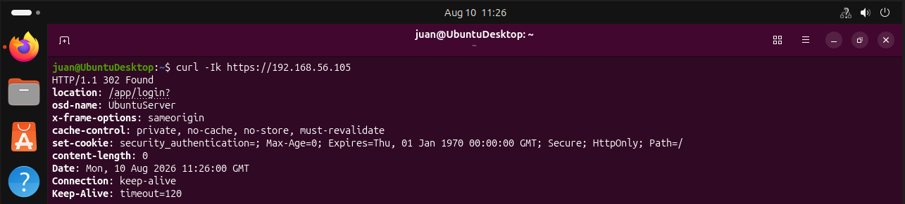
*curl HTTPS exitoso, respuesta 302 del Wazuh Dashboard.*

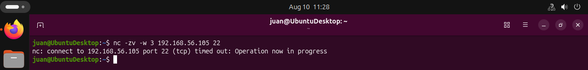
*Conexión SSH bloqueada correctamente (deny-by-default).*

En la interfaz WAN, al no existir ninguna regla por defecto (todo bloqueado), se creó una regla explícita `Pass` para permitir ICMP echo request desde Kali hacia la propia WAN de pfSense, necesaria para las pruebas posteriores.

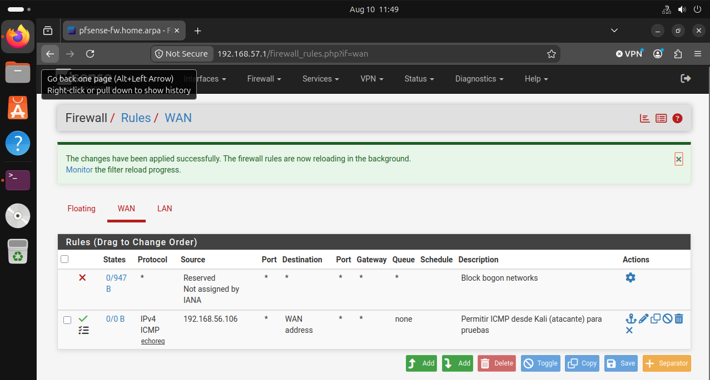
*Ping Kali → WAN pfSense exitoso, tras crear la regla WAN correspondiente.*

---

## Suricata en pfSense: instalación y modo IDS

### Instalación del paquete

La instalación desde **System → Package Manager** falló inicialmente con el error *"Another instance of pfSense-upgrade is running"*. El diagnóstico reveló que la causa real era que `pkg` (el gestor de paquetes de FreeBSD) no estaba bootstrapeado, y `pkg bootstrap -f` fallaba por falta de acceso real a internet — el mismo patrón de bug que en la instalación inicial de pfSense.

Solución: reactivar temporalmente NAT/DHCP en el Adaptador 1, resolver el conflicto de gateway por defecto (ver Lecciones Aprendidas), ejecutar `pkg bootstrap -f` con éxito, e instalar el paquete desde la interfaz web.

### Descarga de reglas y activación en WAN

- **Services → Suricata → Global Settings**: se activó el ruleset **ET Open Rules** (Emerging Threats Open, gratuito).
- **Services → Suricata → Updates**: descarga forzada del ruleset (botón *Force*).
- **Services → Suricata → Interfaces**: se añadió la interfaz **WAN**, inicialmente en modo Legacy/IDS.
- **Categories**: por defecto, ninguna categoría de ET Open venía activada (solo las de "Default Rules", eventos internos del motor). Se activaron manualmente:
  - `emerging-scan.rules`
  - `emerging-attack_response.rules`
  - `emerging-icmp.rules`
  - Posteriormente, para ampliar cobertura: `emerging-exploit.rules`, `emerging-malware.rules`, `emerging-compromised.rules`, `emerging-current_events.rules`

### Verificación de detección

Con `nmap -sS -Pn 192.168.56.10` lanzado desde Kali, Suricata generó alertas del tipo `ET SCAN Suspicious inbound to [MySQL|PostgreSQL|Oracle|MSSQL] port [puerto]`, visibles tanto en **Services → Suricata → Alerts** como en el archivo `alerts.log` de la instancia.

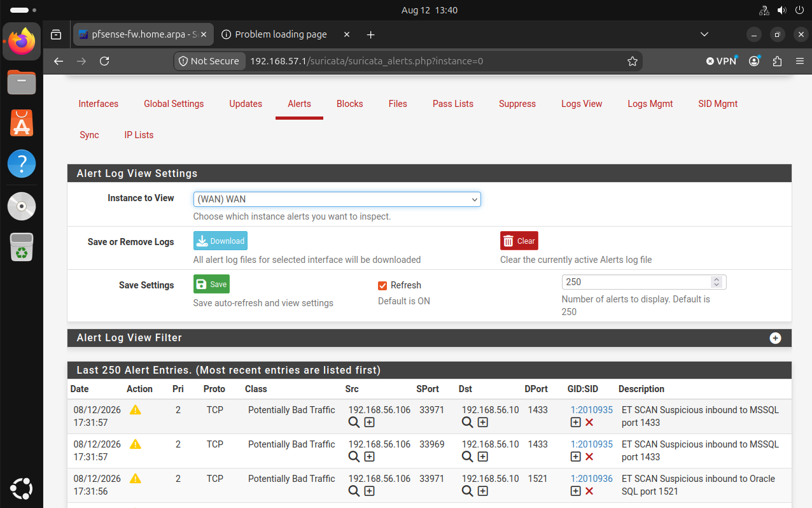
*Alertas ET SCAN generadas por el escaneo de Kali, vistas desde la interfaz web de Suricata en pfSense.*

---

## Modo IPS: de la detección al bloqueo activo

Pasar de detección pura (IDS) a bloqueo activo (IPS) requirió tres cambios encadenados:

1. **Block Offenders**: en la configuración de la interfaz WAN (*WAN Settings → Alert and Block Settings*), se marcó la casilla *"Block Offenders"*, lo que reveló un desplegable adicional de **IPS Mode**.
2. **Inline Mode**: se seleccionó frente a *Legacy Mode*. La diferencia es clave:
   - *Legacy Mode* inspecciona una **copia** del tráfico (vía PCAP); el paquete original ya siguió su camino antes de que Suricata decida bloquear, por lo que solo reacciona bloqueando la IP origen para paquetes *futuros*.
   - *Inline Mode* inserta a Suricata **en la ruta real** del tráfico (entre la NIC y el sistema operativo), permitiéndole descartar el paquete malicioso en el momento, sin dejarlo pasar nunca.
3. **dropsid.conf (SID Mgmt)**: activar Inline Mode no basta — por defecto, todas las reglas siguen teniendo acción `ALERT`, no `DROP`. En **Services → Suricata → SID Mgmt**, se activó *"Enable Automatic SID State Management"* y se creó una lista de tipo *Drop SID List* con los SIDs de las reglas de escaneo detectadas:
   ```
   1:2010937,1:2010939,1:2010936,1:2010935,1:2002910
   ```
   Esta lista se asignó a la interfaz WAN en la tabla de *Interface SID Management List Assignments*, marcando la casilla *Rebuild*.

### Verificación del bloqueo real

Repitiendo el escaneo de Kali, el log de alertas mostró la etiqueta `[Drop]` en lugar de solo la alerta normal:
```
[Drop] [**] [1:2010937:3] ET SCAN Suspicious inbound to mySQL port 3306 [**] ...
```
En la interfaz web, **Services → Suricata → Alerts** mostró las filas resaltadas en rojo, con la nota: *"Alerts triggered by DROP rules that resulted in dropped (blocked) packets are shown with highlighted rows"*.

**Nota sobre la pestaña "Blocks":** esta pestaña permaneció vacía durante todas las pruebas, no por un fallo, sino porque solo muestra bloqueos por IP completa generados en *Legacy Mode*. En *Inline Mode*, el bloqueo es granular (por paquete/regla), y su evidencia visual correcta está en la pestaña *Alerts*, no en *Blocks*.

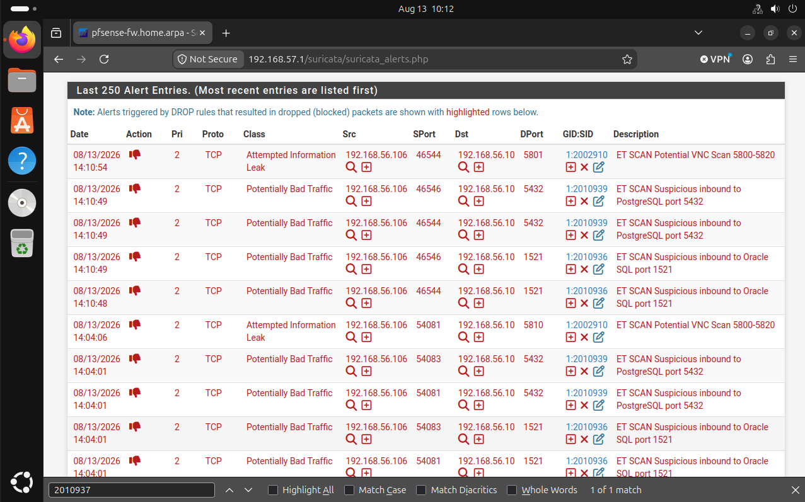
*Alertas resaltadas en rojo en la pestaña Alerts, indicando paquetes bloqueados por reglas DROP en modo Inline IPS. Esta misma evidencia se confirmó también por consola, con la etiqueta `[Drop]` visible en el log de Suricata (`alerts.log`).*

---

## Integración con Wazuh

A diferencia del Proyecto 3 (donde Suricata corría en el mismo host que el agente Wazuh, con acceso directo al archivo `eve.json`), aquí Suricata corre dentro de pfSense (FreeBSD), sin agente Wazuh instalable. La integración se realizó vía **syslog remoto**.

### Configuración del envío (lado pfSense)

1. **Services → Suricata → Interfaces → WAN Settings → EVE Output Settings**: se activó *EVE JSON Log*, con *EVE Output Type* = `SYSLOG`, facility `LOCAL1`, prioridad `NOTICE`. Al guardar, pfSense auto-activó *"Send Alerts to System Log"*, requisito para que el EVE JSON llegue al log del sistema.
2. **Status → System Logs → Settings**: se activó *Enable Remote Logging*, con destino `192.168.56.105:514` (Wazuh Manager) y *Remote Syslog Contents* = `Everything` (no existe una opción específica para paquetes de terceros como Suricata).

### Recepción (lado Wazuh Manager)

En `/var/ossec/etc/ossec.conf`, se añadió un segundo bloque `<remote>` (sin tocar el existente para agentes seguros por TCP/1514):
```xml
<remote>
  <connection>syslog</connection>
  <port>514</port>
  <protocol>udp</protocol>
  <allowed-ips>192.168.56.10</allowed-ips>
</remote>
```

### Decoder y regla personalizados

El primer intento —decodificar el JSON completo con `plugin_decoder: JSON_Decoder` en un decoder padre/hijo basado en `program_name`— no funcionó de forma fiable: pfSense no envía un *hostname* de syslog estándar (manda directamente `suricata[PID]: {json}`), lo que hacía que Wazuh interpretara mal la cabecera del mensaje y el campo `program_name` nunca se rellenara como se esperaba.

La solución final, más simple y robusta, extrae directamente el texto de la firma del ataque mediante una expresión regular, sin depender del parseo completo del JSON:

**Decoder** (`/var/ossec/etc/decoders/local_decoder.xml`):
```xml
<decoder name="suricata-pfsense-alert">
  <prematch type="pcre2">suricata\[\d+\]: \{.*"event_type":"alert"</prematch>
  <regex type="pcre2">"signature":"([^"]+)"</regex>
  <order>extra_data</order>
</decoder>
```

**Regla** (`/var/ossec/etc/rules/local_rules.xml`):
```xml
<group name="suricata,pfsense,">
  <rule id="100050" level="7">
    <decoded_as>suricata-pfsense-alert</decoded_as>
    <description>Suricata (pfSense WAN) alert: $(extra_data)</description>
    <group>ids,suricata,</group>
  </rule>
</group>
```

### Verificación

Tras validar la sintaxis (`wazuh-analysisd -t`) y reiniciar el servicio, un escaneo desde Kali generó alertas visibles en `alerts.log`:
```
Rule: 100050 (level 7) -> 'Suricata (pfSense WAN) alert: ET SCAN Suspicious inbound to Oracle SQL port 1521'
```
Y en el Dashboard web de Wazuh, filtrando por `rule.id: 100050`, se confirmaron **18 alertas** correctamente correlacionadas en las últimas 24 horas.

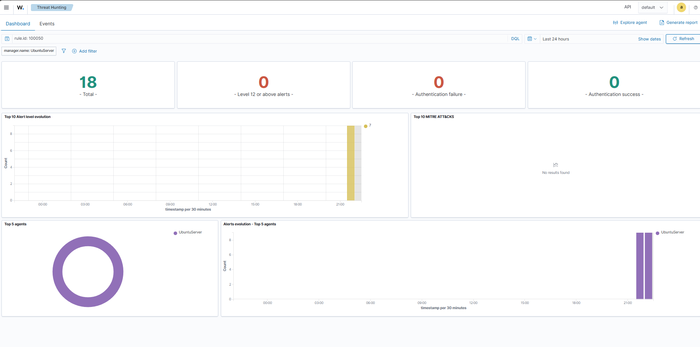
*Dashboard de Wazuh filtrado por rule.id 100050: 18 alertas correlacionadas correctamente.*

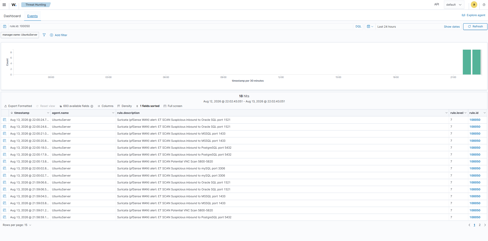
*Listado detallado de las alertas de Suricata (pfSense) recibidas y correlacionadas por Wazuh.*

---

## Comparativa: Suricata en host vs Suricata en firewall perimetral

| Aspecto | Proyecto 3 (host) | Proyecto 4 (firewall) |
|---|---|---|
| Ubicación | Ubuntu Desktop | pfSense (WAN) |
| Visibilidad | Solo tráfico de ese host | Todo el tráfico que cruza el perímetro |
| Modo | IDS (solo detección) | IDS **e** IPS (bloqueo activo) |
| Integración con Wazuh | Directa (mismo host, archivo EVE JSON) | Remota, vía syslog UDP |
| Complejidad de despliegue | Baja | Alta (requiere decoder/regla personalizados) |
| Capacidad de respuesta | Ninguna (solo alerta) | Bloqueo de paquetes en tiempo real |

Ambos enfoques son complementarios en un SOC real: el IDS de host detecta amenazas ya dentro de la red (movimiento lateral, procesos sospechosos en el propio equipo), mientras que el IPS perimetral corta amenazas **antes** de que entren, a costa de mayor complejidad operativa y de despliegue.

---

## Lecciones aprendidas

### 1. Conflicto de IP entre pfSense y el propio host de VirtualBox

**Síntoma:** tras revertir la WAN de pfSense a IP estática `192.168.56.1` (la que se pensaba usar desde el principio), ni el ping ni el nmap desde Kali llegaban a destino, pese a que la interfaz mostraba la IP correcta y el firewall estaba bien configurado.

**Diagnóstico:**
1. `tcpdump -i em0` en pfSense: **0 paquetes capturados** al lanzar el nmap — el tráfico no llegaba ni a nivel de interfaz.
2. `arp -a` en Kali: `192.168.56.1` resolvía a la MAC `0a:00:27:00:00:0e`, que **no coincidía** con la MAC real de `em0` en pfSense (`08:00:27:85:20:3e`).
3. `ipconfig` en el host Windows: el adaptador "VirtualBox Host-Only Network" tenía asignada exactamente esa misma IP, `192.168.56.1`.

**Causa raíz:** el adaptador host-only de VirtualBox en el propio PC anfitrión reserva por defecto la IP `.1` de la subred. Al configurar pfSense con esa misma IP, ambos —el host físico y la VM de pfSense— respondían al ARP de esa dirección, y el tráfico se iba silenciosamente hacia el equipo host en lugar de hacia el firewall.

**Solución:** reasignar la WAN de pfSense a una IP distinta y libre dentro de la misma subred, `192.168.56.10`.

**Aprendizaje:** en topologías con redes host-only de VirtualBox, la IP `.1` de cada subred debe considerarse reservada para el propio host anfitrión, no asignable a ninguna VM.

### 2. Disco lleno por el módulo de detección de vulnerabilidades de Wazuh

**Síntoma:** tras varios reinicios del servicio `wazuh-manager` durante la configuración del envío por syslog, el servicio dejaba de arrancar con error de timeout (`start operation timed out`), sin un mensaje de causa claro.

**Diagnóstico:**
1. `df -h` reveló que la partición raíz estaba al **100% de uso** (24G de 25G).
2. `du -h --max-depth=1 /var/ossec` señaló que `/var/ossec/queue` ocupaba **18 GB**.
3. Desglosando esa carpeta, `/var/ossec/queue/vd` (11 GB) y `/var/ossec/queue/vd_updater` (6.9 GB) —relacionados con el módulo `vulnerability-detection`— concentraban casi todo el espacio.
4. El log general mostraba errores repetidos: `content-updater: ERROR: Decompression failed: Error while writing output file`, señal de que las actualizaciones del feed de vulnerabilidades llevaban tiempo fallando y acumulando datos corruptos sin limpiar.

**Solución:** con el servicio parado, se vació el contenido de ambas carpetas (`rm -rf /var/ossec/queue/vd_updater/*` y `/var/ossec/queue/vd/*`), liberando el disco hasta un 74% de uso, tras lo cual el servicio arrancó con normalidad.

**Aprendizaje:** el módulo de detección de vulnerabilidades de Wazuh puede acumular varios gigabytes de forma silenciosa si sus descargas de feed fallan repetidamente, hasta el punto de tumbar el manager entero por falta de espacio. Merece la pena monitorizar `/var/ossec/queue/vd` y `/var/ossec/queue/vd_updater` en despliegues de larga duración.

### 3. El demonio `syslogd` de pfSense no sobrevive a un reinicio de la VM

**Síntoma:** tras reiniciar todas las máquinas del laboratorio (incluida pfSense) para verificar la persistencia de la configuración, el envío de logs por syslog remoto dejó de funcionar por completo, aunque toda la configuración en la interfaz web seguía intacta (misma IP de destino, mismas casillas marcadas) y Suricata seguía detectando alertas localmente sin problema.

**Diagnóstico:** `pgrep -af syslogd` en la consola de pfSense no devolvía ningún resultado — el propio proceso responsable de enviar los logs no estaba corriendo, probablemente por un arranque prematuro respecto a la disponibilidad de red durante el boot de la VM.

**Solución:** reinicio manual del demonio desde consola:
```
/etc/rc.d/syslogd restart
```

**Aprendizaje:** la configuración correcta en la interfaz web de pfSense no garantiza que el proceso subyacente esté activo. Ante fallos de reenvío de logs tras un reinicio, comprobar primero que el demonio (`syslogd`) esté realmente en ejecución antes de revisar reglas de firewall o configuración de red.

---

## Conclusión

Este proyecto añade al laboratorio SOC una capa de seguridad perimetral completa: firewall con segmentación de red, IDS/IPS con bloqueo activo, e integración con el SIEM central. El valor principal no reside únicamente en la configuración final funcional, sino en el proceso de diagnóstico aplicado ante cada fallo —capa por capa, desde el nivel de red hasta el de aplicación— que constituye una parte fundamental de la práctica real en un rol de SOC o administración de sistemas.
