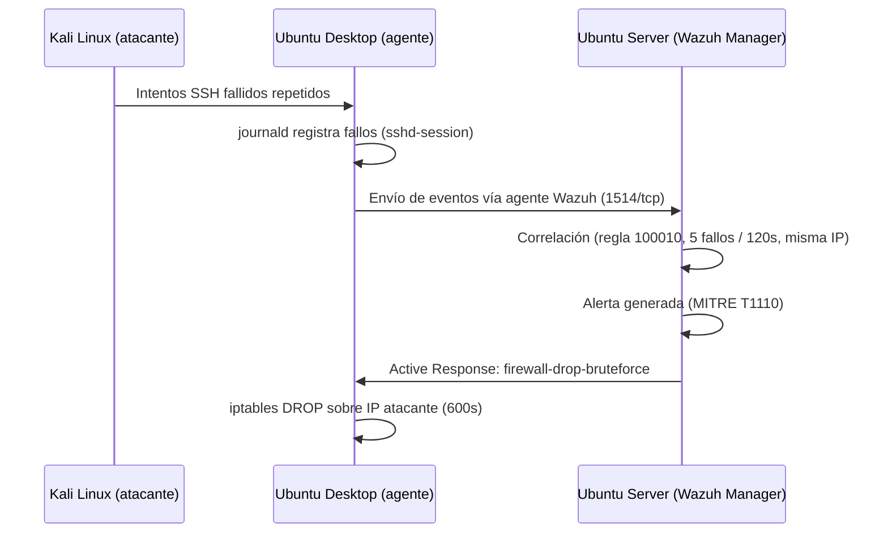
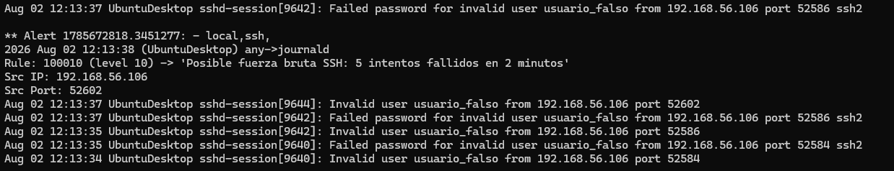
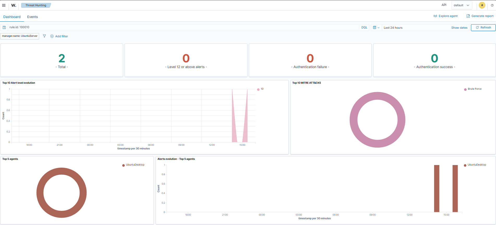
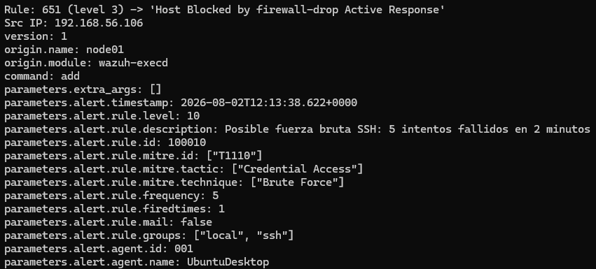
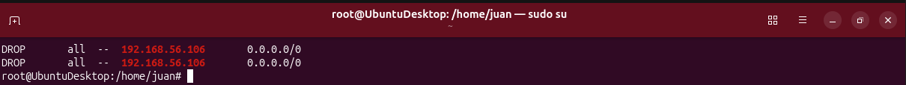
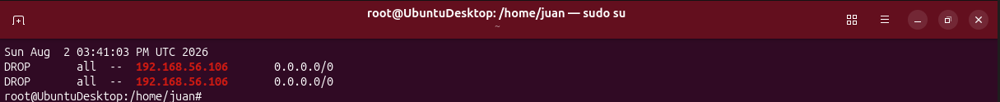
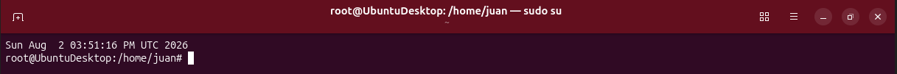

# Playbook de Respuesta a Incidentes: Fuerza Bruta SSH

**Proyecto 2 — Home SOC Lab | Integración SIEM + Respuesta Activa**
**Framework de referencia:** NIST SP 800-61 Rev. 2 (Computer Security Incident Handling Guide)
**Repositorio:** [github.com/juanescanilla/home-soc](https://github.com/juanescanilla/home-soc)

---

## Resumen ejecutivo

Este documento describe el playbook de respuesta ante incidentes de **fuerza bruta SSH** implementado en el laboratorio SOC doméstico, construido sobre Wazuh. A diferencia de un playbook puramente documental, este proyecto incluye **respuesta activa automática**: al detectarse un patrón de fuerza bruta, el sistema bloquea la IP atacante sin intervención humana, además de generar alertas correlacionadas con MITRE ATT&CK.

El playbook cubre las cuatro fases del ciclo de vida de NIST SP 800-61: Preparación, Detección y Análisis, Contención/Erradicación/Recuperación, y Actividad Post-Incidente.

---

## Arquitectura del entorno

| Componente | Rol | IP |
|---|---|---|
| Ubuntu Server | Wazuh Manager, Indexer, Dashboard | 192.168.56.105 |
| Ubuntu Desktop | Agente Wazuh (objetivo monitorizado) | 192.168.56.104 |
| Kali Linux | Máquina atacante | 192.168.56.106 |

Red host-only VirtualBox: `192.168.56.0/24`



---

## Fase 1 — Preparación

### 1.1 Regla de correlación personalizada

```xml
<group name="local,ssh,">
  <rule id="100010" level="10" frequency="5" timeframe="120">
    <if_matched_sid>5710</if_matched_sid>
    <same_source_ip/>
    <description>Posible fuerza bruta SSH: 5 intentos fallidos en 2 minutos</description>
    <mitre>
      <id>T1110</id>
    </mitre>
  </rule>
</group>
```

**Nota de diseño:** inicialmente la regla usaba `<if_matched_group>authentication_failed</if_matched_group>`. Se sustituyó por `<if_matched_sid>5710</if_matched_sid>` tras detectar, mediante `wazuh-logtest`, que la correlación por grupo no disparaba la alerta de forma fiable en este entorno, mientras que la correlación directa contra el ID de la regla base sí lo hacía de forma consistente (ver sección de Lecciones Aprendidas).

### 1.2 Configuración de Active Response (`ossec.conf` — Manager)

```xml
<command>
  <name>firewall-drop-bruteforce</name>
  <executable>firewall-drop</executable>
  <timeout_allowed>yes</timeout_allowed>
</command>

<active-response>
  <command>firewall-drop-bruteforce</command>
  <location>local</location>
  <rules_id>100010</rules_id>
  <timeout>600</timeout>
</active-response>
```

Cuando se dispara la regla `100010`, Wazuh ejecuta `firewall-drop` en el propio agente (`<location>local</location>` = Ubuntu Desktop, la máquina bajo ataque), bloqueando la IP de origen durante 600 segundos (10 minutos), tras los cuales se desbloquea automáticamente.

### 1.3 Fuente de datos

El agente del Desktop recoge los logs de SSH vía `journald` (no `auth.log` directo), ya que Ubuntu Server/Desktop modernos centralizan el logging del sistema mediante `systemd-journald`:

```xml
<localfile>
  <log_format>journald</log_format>
  <location>journald</location>
</localfile>
```

---

## Fase 2 — Detección y Análisis

### 2.1 Simulación del ataque

Desde Kali, se simuló un ataque de fuerza bruta contra el servicio SSH del Desktop:

```bash
for i in {1..8}; do
  sshpass -p "wrong$i" ssh -o StrictHostKeyChecking=no usuario_falso@192.168.56.104
done
```

### 2.2 Evidencia de detección

journald en el Desktop registró la secuencia de fallos (proceso `sshd-session`, la nueva arquitectura de privilege-separation de OpenSSH en Ubuntu 24.04+):

```
Aug 02 12:13:34 UbuntuDesktop sshd-session[9640]: Invalid user usuario_falso from 192.168.56.106 port 52584
Aug 02 12:13:35 UbuntuDesktop sshd-session[9640]: Failed password for invalid user usuario_falso from 192.168.56.106 port 52584 ssh2
Aug 02 12:13:35 UbuntuDesktop sshd-session[9642]: Invalid user usuario_falso from 192.168.56.106 port 52586
Aug 02 12:13:37 UbuntuDesktop sshd-session[9642]: Failed password for invalid user usuario_falso from 192.168.56.106 port 52586 ssh2
Aug 02 12:13:37 UbuntuDesktop sshd-session[9644]: Invalid user usuario_falso from 192.168.56.106 port 52602
```

Wazuh correlacionó estos eventos y generó la alerta:

```
** Alert 1785672818.3451277: - local,ssh,
2026 Aug 02 12:13:38 (UbuntuDesktop) any->journald
Rule: 100010 (level 10) -> 'Posible fuerza bruta SSH: 5 intentos fallidos en 2 minutos'
Src IP: 192.168.56.106
```


### 2.3 Mapeo MITRE ATT&CK

| Táctica | Técnica | ID |
|---|---|---|
| Credential Access | Brute Force | T1110 |



---

## Fase 3 — Contención, Erradicación y Recuperación

### 3.1 Respuesta activa automática

En el mismo segundo en que se generó la alerta `100010`, Wazuh ejecutó el Active Response configurado:

```
Rule: 651 (level 3) -> 'Host Blocked by firewall-drop Active Response'
2026/08/02 12:13:38 active-response/bin/firewall-drop:
  "command":"add"
  "rule":{"id":"100010","description":"Posible fuerza bruta SSH: 5 intentos fallidos en 2 minutos",
          "mitre":{"id":["T1110"],"tactic":["Credential Access"],"technique":["Brute Force"]}}
  "agent":{"id":"001","name":"UbuntuDesktop","ip":"192.168.56.104"}
```


### 3.2 Verificación de contención a nivel de sistema

Confirmación directa en el firewall del Desktop:

```bash
$ sudo iptables -L -n | grep 192.168.56.106
DROP   all -- 192.168.56.106   0.0.0.0/0
DROP   all -- 192.168.56.106   0.0.0.0/0
```


**Efecto observado:** los intentos SSH posteriores desde Kali quedaron en timeout (sin respuesta), confirmando que el bloqueo cortó la conectividad de red del atacante en pleno ataque, sin intervención manual.

### 3.3 Recuperación

El bloqueo tiene un `timeout` de 600 segundos, tras los cuales `firewall-drop` retira automáticamente la regla de `iptables`, restaurando la conectividad. Esto evita bloqueos permanentes accidentales (por ejemplo, ante un falso positivo) sin requerir intervención del analista.

**Bloqueo activo, inmediatamente tras el ataque (15:41:03):**



**Mismo comando, 10 minutos después (15:51:16) — la IP ya no aparece, bloqueo retirado automáticamente:**



---

## Fase 4 — Actividad Post-Incidente (Lecciones Aprendidas)

Esta sección documenta problemas operativos reales encontrados durante las pruebas del playbook — no como fallos del diseño, sino como hallazgos de troubleshooting propios de un entorno SIEM en producción.

### 4.1 Wazuh y la rotación de journald tras reinicio de VM

**Síntoma:** tras reiniciar las VMs, dejaron de llegar alertas SSH al Manager, pese a que el agente aparecía "Active" y journald en el Desktop sí registraba los fallos.

**Causa raíz:** es un comportamiento conocido de Wazuh — al reiniciar una máquina con `systemd-journald`, se genera un journal nuevo asociado al nuevo boot ID, y el `logcollector` del agente no siempre reengancha su cursor de lectura automáticamente.

**Mitigación aplicada:** `sudo systemctl restart wazuh-agent` tras cada reinicio de VM.

**Mejora propuesta a futuro:** script de *health-check* (cron) que verifique periódicamente si el `logcollector` sigue recibiendo eventos de journald y reinicie el servicio del agente si detecta un corte.

### 4.2 Bucle de retroalimentación del clasificador (`clasificador-soc.service`)

**Síntoma:** el archivo `alerts.log` se inundaba de alertas repetidas de tipo `2501 (syslog: User authentication failure)` originadas por el propio Manager, enmascarando las alertas reales del ataque simulado.

**Causa raíz:** `clasificador.py` (Proyecto 1) imprime su resultado de clasificación por `stdout`, lo cual `systemd` captura y envía al journald del propio Manager. Como Wazuh también monitoriza el journald del Manager, relee ese log, lo interpreta como un nuevo evento de fallo de autenticación (porque el texto contiene la frase "authentication failure") y genera una alerta nueva — que el clasificador vuelve a procesar, cerrando el bucle.

**Mitigación aplicada durante las pruebas:** parada temporal del servicio (`sudo systemctl stop clasificador-soc.service`) para aislar el ruido durante el diagnóstico.

**Solución aplicada:** se configuró `systemd` para redirigir la salida del servicio (`StandardOutput` / `StandardError`) a un fichero de log plano (`/var/log/clasificador-soc.log`), fuera del alcance de journald:

```ini
[Service]
...
StandardOutput=append:/var/log/clasificador-soc.log
StandardError=append:/var/log/clasificador-soc.log
```

Tras reiniciar el servicio (`sudo systemctl daemon-reload && sudo systemctl restart clasificador-soc.service`), se verificó que el clasificador sigue procesando alertas con normalidad y que el bucle de retroalimentación no vuelve a producirse en `alerts.log`.

### 4.3 Correlación por grupo (`if_matched_group`) vs. por ID de regla (`if_matched_sid`)

**Síntoma:** la regla `100010`, definida con `<if_matched_group>authentication_failed</if_matched_group>`, no llegaba a dispararse pese a que los eventos individuales (regla `5710`) se generaban correctamente y en el volumen y ventana temporal esperados.

**Diagnóstico:** usando `wazuh-logtest` para inyectar 5 eventos idénticos de forma controlada, se confirmó que el contador de correlación (`firedtimes`) incrementaba correctamente en cada evento, pero la regla `100010` nunca aparecía en la Fase 3 de filtrado — únicamente la regla base `5710`.

**Solución:** sustituir `if_matched_group` por `if_matched_sid` apuntando directamente al ID de la regla base (`5710`), replicando el mismo patrón que usa la regla de fábrica `5712` (fuerza bruta genérica de Wazuh), que sí funcionaba de forma consistente en el entorno.

**Aprendizaje:** ante fallos de correlación silenciosos (sin error en los logs), `wazuh-logtest` es la herramienta más fiable para aislar si el problema está en la ingesta de eventos o en la lógica de la propia regla.

---

## Anexos

### A. Comandos de diagnóstico utilizados

```bash
# Estado del agente desde el Manager
sudo /var/ossec/bin/agent_control -l
sudo /var/ossec/bin/agent_control -i 001

# Validar sintaxis de reglas y configuración
sudo /var/ossec/bin/wazuh-analysisd -t

# Prueba de reglas contra eventos simulados
sudo /var/ossec/bin/wazuh-logtest

# Verificación de journald en el agente
journalctl -u ssh --since "10 min ago" -o short-iso

# Verificación de bloqueo real
sudo iptables -L -n | grep <IP>
```

### B. Referencias

- NIST SP 800-61 Rev. 2 — Computer Security Incident Handling Guide
- MITRE ATT&CK — [T1110: Brute Force](https://attack.mitre.org/techniques/T1110/)
- Documentación oficial de Wazuh — Active Response y Journald log collection

## Próximos pasos
- IDS de red con Suricata, integrado con Wazuh (EVE JSON) para detección a nivel de red.
- Integración con más fuentes (Docker, cloud).
