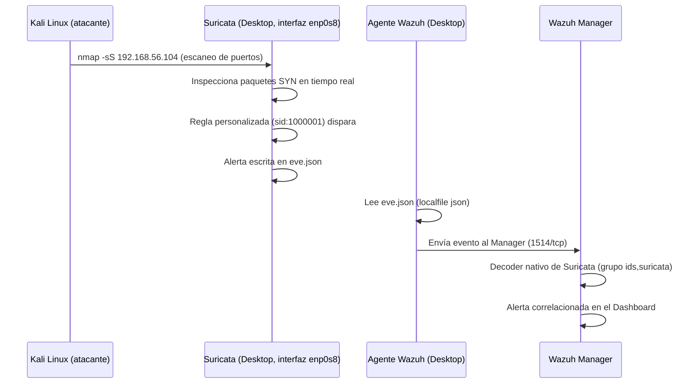
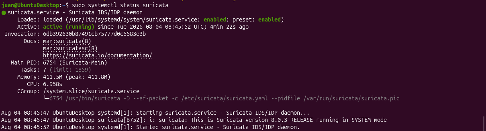
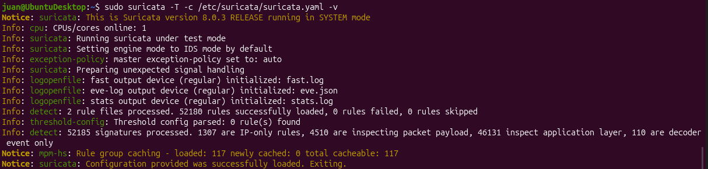
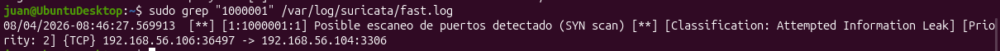
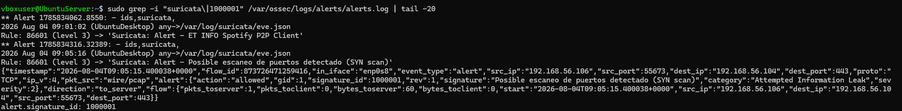

# IDS de Red con Suricata, Integrado con Wazuh

**Proyecto 3 — Home SOC Lab | Detección de Red (NIDS)**

## Índice

1. [Resumen ejecutivo](#resumen-ejecutivo)
2. [Arquitectura del entorno](#arquitectura-del-entorno)
3. [Instalación y configuración](#instalación-y-configuración)
4. [Regla personalizada: detección de escaneo de puertos](#regla-personalizada-detección-de-escaneo-de-puertos)
5. [Evidencia de detección](#evidencia-de-detección)
6. [Integración con Wazuh](#integración-con-wazuh)
7. [Resultado](#resultado)
8. [Próximos pasos](#próximos-pasos)

---

## Resumen ejecutivo

Los Proyectos 1 y 2 detectan amenazas a partir de logs que el propio sistema operativo genera (SSH, `sudo`, gestión de cuentas) — es decir, detección basada en host (**HIDS**). Esta capa tiene un límite estructural: solo detecta lo que una aplicación decide registrar. Un escaneo de puertos, por ejemplo, no genera ninguna entrada de log en el sistema atacado, porque es tráfico de red gestionado directamente por el kernel, sin intervención de ninguna aplicación.

Este proyecto añade una segunda capa de detección: **Suricata**, un IDS de red (**NIDS**) que inspecciona el tráfico directamente según circula por la interfaz de red, sin depender de que ninguna aplicación lo registre. Sus alertas se integran con Wazuh, de forma que la detección de host y la detección de red conviven en el mismo Dashboard centralizado.

---

## Arquitectura del entorno

Reutiliza la misma infraestructura de los Proyectos 1 y 2 (VirtualBox, red host-only `192.168.56.0/24`), añadiendo Suricata como componente nuevo en el Ubuntu Desktop:

| Componente | Rol | IP |
|---|---|---|
| Ubuntu Server | Wazuh Manager, Indexer, Dashboard | 192.168.56.105 |
| Ubuntu Desktop | Agente Wazuh + **Suricata (NIDS)** | 192.168.56.104 |
| Kali Linux | Máquina atacante | 192.168.56.106 |



**Por qué Suricata vive en el Desktop:** necesita inspeccionar el tráfico que llega a la máquina bajo ataque, igual que el agente Wazuh — por eso se instala en el mismo host que se quiere proteger, escuchando su interfaz de red (`enp0s8`, la interfaz host-only, no la NAT `enp0s3` usada para acceso a internet).

---

## Instalación y configuración

### 1. Instalación

```bash
sudo apt update
sudo apt install suricata -y
```

### 2. Configurar la interfaz de red a vigilar

En `/etc/suricata/suricata.yaml`, sección `af-packet`:

```yaml
af-packet:
  - interface: enp0s8
```

### 3. Descargar el set de reglas (Emerging Threats Open)

```bash
sudo suricata-update
```

Resultado: **68.118 reglas** descargadas, **52.179 activadas** por defecto.

### 4. Validar la configuración antes de arrancar

```bash
sudo suricata -T -c /etc/suricata/suricata.yaml -v
```
```
Info: detect: 1 rule files processed. 52179 rules successfully loaded, 0 rules failed, 0 rules skipped
Notice: suricata: Configuration provided was successfully loaded. Exiting.
```

### 5. Arrancar el servicio

```bash
sudo systemctl enable suricata
sudo systemctl start suricata
```



---

## Regla personalizada: detección de escaneo de puertos

El set de reglas de Emerging Threats Open está orientado a firmas de malware y exploits conocidos — no incluye, por defecto, una regla genérica de detección de escaneo de puertos (para evitar falsos positivos en redes con monitorización legítima). Un escaneo `nmap -sS` estándar contra 1000 puertos no genera ninguna alerta con el set de fábrica.

Se creó una firma propia en `/var/lib/suricata/rules/local.rules`:

```
alert tcp any any -> $HOME_NET any (msg:"Posible escaneo de puertos detectado (SYN scan)"; flags:S; threshold:type both, track by_src, count 20, seconds 10; classtype:attempted-recon; sid:1000001; rev:1;)
```

**Lógica de la regla:**
- `flags:S` — solo paquetes con el flag SYN (primer paso de una conexión TCP, típico de un escaneo)
- `threshold:type both, track by_src, count 20, seconds 10` — dispara si la misma IP origen envía 20+ paquetes SYN en 10 segundos
- `classtype:attempted-recon` — clasificado como intento de reconocimiento

El archivo se registró en `suricata.yaml`:
```yaml
rule-files:
  - suricata.rules
  - local.rules
```

### Validación de la sintaxis

```bash
sudo suricata -T -c /etc/suricata/suricata.yaml -v
```
```
Info: detect: 2 rule files processed. 52180 rules successfully loaded, 0 rules failed, 0 rules skipped
```



---

## Evidencia de detección

Simulación de escaneo desde Kali:

```bash
nmap -sS 192.168.56.104
```

Suricata detectó el patrón y generó la alerta en `/var/log/suricata/fast.log`:

```
[**] [1:1000001:1] Posible escaneo de puertos detectado (SYN scan) [**] [Classification: Attempted Information Leak] [Priority: 2] {TCP} 192.168.56.106:36497 -> 192.168.56.104:3306
```



---

## Integración con Wazuh

### Configuración del agente (`ossec.conf` — Desktop)

```xml
<localfile>
  <log_format>json</log_format>
  <location>/var/log/suricata/eve.json</location>
</localfile>
```

Tras reiniciar el agente (`sudo systemctl restart wazuh-agent`), Wazuh empieza a leer el archivo `eve.json` de Suricata. A diferencia de las reglas SSH del Proyecto 2, **no fue necesario escribir ninguna regla de correlación adicional en Wazuh**: la plataforma incluye un decoder nativo para el formato EVE JSON de Suricata, que reconoce y traduce automáticamente sus alertas.

### Verificación

```bash
sudo grep -i "suricata\|1000001" /var/ossec/logs/alerts/alerts.log
```

```
** Alert 1785834316.32389: - ids,suricata,
2026 Aug 04 09:05:16 (UbuntuDesktop) any->/var/log/suricata/eve.json
Rule: 86601 (level 3) -> 'Suricata: Alert - Posible escaneo de puertos detectado (SYN scan)'
```

El JSON completo confirma el origen (Kali, `192.168.56.106`) y destino (Desktop, `192.168.56.104`), con el `signature_id: 1000001` correspondiente a la regla propia.



---

## Resultado

Con esta integración, el SOC pasa de tener una sola capa de detección (host, vía journald) a dos capas complementarias:

| Capa | Herramienta | Detecta |
|---|---|---|
| Host (HIDS) | Wazuh (Proyecto 1-2) | Fallos de login, gestión de cuentas, cambios de sistema |
| Red (NIDS) | Suricata (Proyecto 3) | Escaneos de puertos, firmas de exploits, tráfico anómalo |

Ambas capas convergen en el mismo Dashboard de Wazuh, dando una visión unificada del ataque — desde el reconocimiento (escaneo) hasta la explotación (por ejemplo, fuerza bruta SSH, Proyecto 2).

---

## Próximos pasos

- Firewall perimetral (pfSense/OPNsense) con Suricata como motor IDS/IPS integrado, añadiendo una capa de prevención perimetral.
- Reglas adicionales para detección de tráfico C2 y exfiltración de datos.

